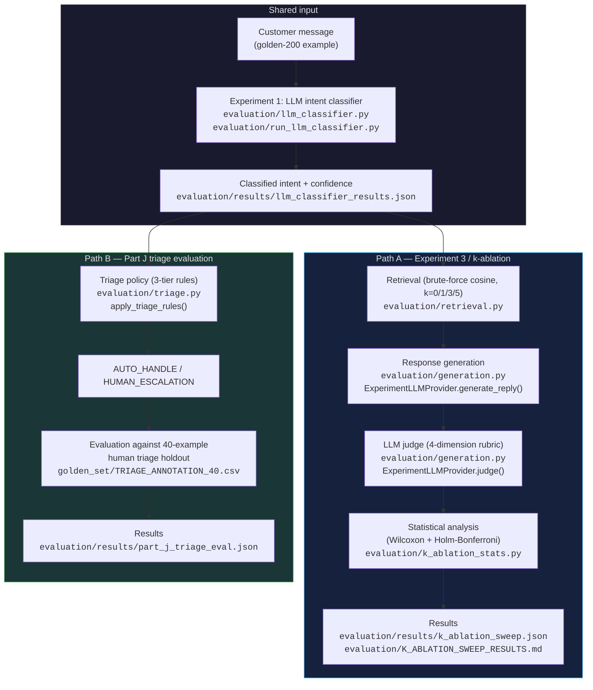

# As-Built Architecture

This document describes the system **as it actually exists and was actually
evaluated** — not an aspirational design. Every stage and connection below is
directly supported by inspectable code and result files in this repository.

> **Relationship to earlier diagrams:** The flow diagram in
> `implementation_plan.md` §2 describes the data/evaluation-pool flow used
> during planning (how data moves from `twcs.csv` through the three-way split
> into each experiment's input). It should not be interpreted as a literal
> runtime architecture diagram. This document is the current as-built
> representation. Earlier diagrams in `hiver_sde_takehome_strategy.md`,
> `PROJECT_CONTEXT.md`, and `implementation_plan.md` remain as historical
> planning artifacts and are intentionally not modified or reconciled here.

---

## Two separate, independently-evaluated paths

The system was built and evaluated as **two separate evaluation paths that
share a common classification input but are not wired into one single literal
runtime pipeline or single entry-point script.** This is deliberate and
consistent with the project's avoid-over-engineering approach
(`DECISION_LOG.md` #14) — each path was built, tested, and evaluated on its
own terms, rather than shoehorned into a unified orchestrator that would add
complexity without adding evaluation value.

### What this diagram makes explicit

- **Triage does NOT receive retrieved evidence.** `apply_triage_rules()` takes
  `(customer_text, classified_intent, confidence=None)` — no retrieval results
  parameter exists in its signature
  ([triage.py L366](evaluation/triage.py)).
- **Retrieval, generation, and judging are a separate evaluation path.**
  `run_k_ablation_sweep.py`'s `run_one()` calls `retrieve_top_k()` →
  `provider.generate_reply()` → `provider.judge()` — it never calls
  `apply_triage_rules()`
  ([run_k_ablation_sweep.py L103-139](evaluation/run_k_ablation_sweep.py)).
- **There is no hidden classify → retrieve → generate → triage chain.** The
  two paths share the classification concept/input (both read from
  `evaluation/results/llm_classifier_results.json`) but are evaluated
  independently.
- **Each path has its own entry-point script.** Path A:
  `evaluation/run_k_ablation_sweep.py`. Path B:
  `evaluation/run_part_j_triage_eval.py`. Neither calls the other.

---

## Evaluation boundaries

### Experiment 3 / k-ablation (Path A)

Evaluates the **classify → retrieve → generate → judge** path.

- **Entry point:** `evaluation/run_k_ablation_sweep.py`
- **Scope:** All 200 golden examples × 4 k-conditions (k=0, 1, 3, 5) = 800
  generate+judge pairs.
- **Classification source:** Experiment 1's cached `predicted_intent` from
  `evaluation/results/llm_classifier_results.json` — never the gold label.
- **Retrieval:** `evaluation/retrieval.py` → brute-force cosine similarity
  over a 3,000-pair index from the RETRIEVAL pool. Customer-message-only
  embeddings.
- **Generation:** `evaluation/generation.py` →
  `ExperimentLLMProvider.generate_reply()`, with evidence cleaned via
  `clean_brand_text()`.
- **Judging:** `evaluation/generation.py` →
  `ExperimentLLMProvider.judge()`, scoring Relevance / Groundedness /
  Helpfulness / Tone (1–5).
- **Statistical analysis:** `evaluation/k_ablation_stats.py` → paired
  Wilcoxon signed-rank tests, Holm-Bonferroni corrected across all 12
  comparisons.
- **Result files:** `evaluation/results/k_ablation_sweep.json`,
  `evaluation/K_ABLATION_SWEEP_RESULTS.md`,
  `evaluation/results/k_ablation_stats_results.json`.

### Part J triage evaluation (Path B)

Evaluates the **classify → triage** path separately, on a dedicated
40-example human holdout.

- **Entry point:** `evaluation/run_part_j_triage_eval.py`
- **Scope:** 40 human-annotated triage examples × 2 arms (Tier-2
  ACCOUNT_ACCESS rule ON/OFF) × 2 intent sources (gold vs. LLM-predicted) =
  4 conditions.
- **Classification source:** Both Experiment 1's cached `predicted_intent`
  (realistic pipeline) and `human_gold_label` (idealized), evaluated
  separately as distinct arms.
- **Triage:** `evaluation/triage.py` → `apply_triage_rules(customer_text,
  classified_intent, confidence)` → `AUTO_HANDLE` or `HUMAN_ESCALATION`.
  Pure Python, no API calls, no retrieval.
- **Ground truth:** `golden_set/TRIAGE_ANNOTATION_40.csv` — a separate,
  additive annotation (`DECISION_LOG.md` #26), not derived from golden-200
  intent labels.
- **Result file:** `evaluation/results/part_j_triage_eval.json`.

### The two evaluations are separate experiments

They are **not** one unified runtime pipeline. Each was designed, implemented,
and run as an independent experiment with its own entry-point script, its own
evaluation data, and its own result files. The classification output they
share is a cached artifact (`llm_classifier_results.json`), not a runtime
data flow between the two paths.

---

## Additional evaluation components (not on the two main paths)

These experiments also exist in the repository but are independent of both
Path A and Path B:

| Experiment | Script | What it evaluates |
|---|---|---|
| Experiment 1: Classification | `evaluation/run_llm_classifier.py`, `evaluation/run_baselines.py` | LLM few-shot vs. majority-class vs. TF-IDF+LogReg, on golden-200 |
| Experiment 2: Calibration | `evaluation/run_calibration.py` | Classifier confidence calibration (ECE, Brier, per-bucket accuracy) |
| Judge-human calibration (Part I) | `evaluation/analyze_judge_human_agreement.py` | Judge vs. human agreement on 40-example k=3 subset |
| Tier-2 robustness audit | `evaluation/audit_triage_tier2.py` | Fisher's exact test + robustness check on the ACCOUNT_ACCESS rule |
| Retrieval inspection | `evaluation/build_retrieval_inspection_workbook.py` | 20-example manual retrieval-quality review |
